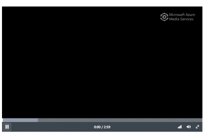

 
# Azure Media Player Samples

The samples in this repo show how to embed the Azure Media player either dynamically with JavaScript or statically with HTML5 video element attributes.

## Contents

Outline the file contents of the repository. It helps users navigate the codebase, build configuration and any related assets.

| File/folder       | Description                                |
|-------------------|--------------------------------------------|
| `html`            | Azure Media Player embedding samples       |
| `media`           | folder for animated GIF of player          |
| `.gitignore`      | Define what to ignore at commit time.      |
| `CHANGELOG.md`    | List of changes to the sample.             |
| `CONTRIBUTING.md` | Guidelines for contributing to the sample. |
| `README.md`       | This README file.                          |
| `LICENSE`         | The license for the sample.                |

## Azure Media Player

You can use Azure Media Player to stream videos from Azure Media Services. The samples in this set include basic to advanced configurations (listed below.) See each sample comments on how to use.

You can view the Azure Media Player [demo](https://ampdemo.azureedge.net/azuremediaplayer.html) here.

## Sample Listing

<table>
<tbody>
<tr>
<th>
Sample Name
</th>
<th>
Programatic via JavaScript
</th>
<th>
Static via HTML5 <code>video</code>
</th>
<th>
Description
</th>
</tr>
<tr>
<th style="font:bold;text-align:left" colspan="4">
Basic
</th>
</tr>
<tr>
<td>
Set Source
</td>
<td>
dynamic_setsource.html
</td>
<td>
videotag_setsource.html
</td>
<td>
Playback unprotected content.
</td>
</tr>
<tr>
<th style="font:bold;text-align:left" colspan="4">
Features
</th>
</tr>
<tr>
<td>
VOD Ad insertion - VAST
</td>
<td>
dynamic_vast_ads_vod.html
</td>
<td>
N/A
</td>
<td>
Insert pre- mid- and post- roll VAST ads into a VOD asset.
</td>
</tr>
<tr>
<td>
Playback Speed
</td>
<td>
dynamic_playback_speed.html
</td>
<td>
N/A
</td>
<td>
Enables viewers to control what speed they're watching their video at.
</td>
</tr>
<tr>
<td>
AMP Flush Skin
</td>
<td>
dynamic_flush_skin.html
</td>
<td>
videotag_flush_skin.html
</td>
<td>
Enables new AMP skin. <strong>Please note: AMP flush is only supported in AMP versions 2.1.0+</strong>
</td>
</tr>
<tr>
<td>
Captions and Subtitles
</td>
<td>
dynamic_webvtt.html
</td>
<td>
videotag_webvtt.html
</td>
<td>
Playback with WebVTT subtitles.
</td>
</tr>
<tr>
<td>
Live CEA 708 Captions
</td>
<td>
dynamic_live_captions.html
</td>
<td>
N/A
</td>
<td>
Playback with live CEA 708 inbound captions with the captions left-aligned.
</td>
</tr>
<tr>
<td>
Streaming with Progressive Fallback
</td>
<td>
dynamic_progressiveFallback.html
</td>
<td>
videotag_progressiveFallback.html
</td>
<td>
Basic setup of adaptive playback with fallback for progressive if streaming not supported on platform.
</td>
</tr>
<tr>
<td>
Progressive Video MP4
</td>
<td>
dynamic_progressiveVideo.html
</td>
<td>
videotag_progressiveVideo.html
</td>
<td>
Playback of progressive audio MP4.
</td>
</tr>
<tr>
<td>
Progressive Audio MP3
</td>
<td>
dynamic_progressiveAudio.html
</td>
<td>
videotag_progressiveAudio.html
</td>
<td>
Playback of progressive audio MP3.
</td>
</tr>
<tr>
<td>
DD+
</td>
<td>
dynamic_dolbyDigitalPlus.html
</td>
<td>
N/A
</td>
<td>
Playback of content with DD+ audio.
</td>
</tr>
<tr>
<th style="font:bold;text-align:left" colspan="4">
Options
</th>
</tr>
<tr>
<td>
Heuristic Profile
</td>
<td>
dynamic_heuristicsProfile.html
</td>
<td>
videotag_heuristicsProfile.html
</td>
<td>
Changing the heuristics profile
</td>
</tr>
<tr>
<td>
Localization
</td>
<td>
dynamic_localization.html
</td>
<td>
videotag_localization.html
</td>
<td>
Setting localization
</td>
</tr>
<tr>
<td>
Audio Tracks Menu
</td>
<td>
dynamic_multiAudio.html
</td>
<td>
videotag_multiAudio.html
</td>
<td>
Options to show how to display audio tracks menu on the default skin.
</td>
</tr>
<tr>
<td>
Hotkeys
</td>
<td>
dynamic_hotKeys.html">Dynamic </a>
</td>
<td>
videotag_hotKeys.html
</td>
<td>
This sample shows how to configure which hotkeys are enabled in the player
</td>
</tr>
<tr>
<th style="font:bold;text-align:left" colspan="4">
Events, Logging and Diagnostics
</th>
</tr>
<tr>
<td>
Register Events
</td>
<td>
dynamic_registerEvents.html
</td>
<td>
N/A
</td>
<td>
Playback with event listeners.
</td>
</tr>
<tr>
<td>
Logging
</td>
<td>
dynamic_logging.html
</td>
<td>
videotag_logging.html
</td>
<td>
Turning on verbose logging to console.
</td>
</tr>
<tr>
<td>
Diagnostics
</td>
<td>
dynamic_diagnostics.html
</td>
<td>
N/A
</td>
<td>
Getting diagnostic data. This sample only works on some techs.
</td>
</tr>
<tr>
<th style="font:bold;text-align:left" colspan="4">
AES
</th>
</tr>
<tr>
<td>
AES no token
</td>
<td>
dynamic_aes_notoken.html
</td>
<td>
videotag_aes_notoken.html
</td>
<td>
Playback of AES content with no token.
</td>
</tr>
<tr>
<td>
AES token
</td>
<td>
dynamic_aes_token.html
</td>
<td>
videotag_aes_token.html
</td>
<td>
Playback of AES content with token.
</td>
</tr>
<tr>
<td>
AES HLS proxy simulation
</td>
<td>
dynamic_aes_token_withHLSProxy.html
</td>
<td>
videotag_aes_token_withHLSProxy.html
</td>
<td>
Playback of AES content with token, showing a proxy for HLS so that token can be used with iOS devices.
</td>
</tr>
<tr>
<td>
AES token force flash
</td>
<td>
dynamic_aes_token_forceFlash.html
</td>
<td>
videotag_aes_token_forceFlash.html
</td>
<td>
Playback of AES content with token, forcing the flashSS tech.
</td>
</tr>
<tr>
<th style="font:bold;text-align:left" colspan="4">
DRM
</th>
</tr>
<tr>
<td>
Multi-DRM with PlayReady, Widevine, and FairPlay
</td>
<td>
dynamic_multiDRM_PlayReadyWidevineFairPlay_notoken.html
</td>
<td>
videotag_multiDRM_PlayReadyWidevineFairPlay_notoken.html
</td>
<td>
Playback of DRM content with no token, with PlayReady, Widevine, and FairPlay headers.
</td>
</tr>
<tr>
<td>
PlayReady no token
</td>
<td>
dynamic_playready_notoken.html
</td>
<td>
videotag_playready_notoken.html
</td>
<td>
Playback of PlayReady content with no token.
</td>
</tr>
<tr>
<td>
PlayReady no token force Silverlight
</td>
<td>
dynamic_playready_notoken_forceSilverlight.html
</td>
<td>
videotag_playready_notoken_forceSilverlight.html
</td>
<td>
Playback of PlayReady content with no token, forcing silverlightSS tech.
</td>
</tr>
<tr>
<td>
PlayReady token
</td>
<td>
dynamic_playready_token.html
</td>
<td>
videotag_playready_token.html
</td>
<td>
Playback of PlayReady content with token.
</td>
</tr>
<tr>
<td>
PlayReady token force Silverlight
</td>
<td>
dynamic_playready_token_forceSilverlight.html
</td>
<td>
videotag_playready_token_forceSilverlight.html
</td>
<td>
Playback of PlayReady content with token, forcing silverlightSS tech.
</td>
</tr>
<tr>
<th style="font:bold;text-align:left" colspan="4">
Protocol and Tech
</th>
</tr>
<tr>
<td>
Change techOrder
</td>
<td>
dynamic_techOrder.html
</td>
<td>
videotag_techOrder.html
</td>
<td>
Changing the tech order
</td>
</tr>
<tr>
<td>
Force MPEG-DASH only in UrlRewriter
</td>
<td>
dynamic_forceDash.html
</td>
<td>
videotag_forceDash.html
</td>
<td>
Playback of unprotected content only using the DASH protocol.
</td>
</tr>
<tr>
<td>
Exclude MPEG-DASH in UrlRewriter
</td>
<td>
dynamic_forceNoDash.html
</td>
<td>
videotag_forceNoDash.html
</td>
<td>
Playback of unprotected content only using the Smooth and HLS protocols.
</td>
</tr>
<tr>
<td>
Multiple delivery policy
</td>
<td>
dynamic_multipleDeliveryPolicy.html
</td>
<td>
videotag_multipleDeliveryPolicy.html
</td>
<td>
Setting the source with content that has multiple delivery policies from Azure Media Services
</td>
</tr>
<tr>
<th style="font:bold;text-align:left" colspan="4">
Programatically Select
</th>
</tr>
<tr>
<td>
Select text track
</td>
<td>
dynamic_selectTextTrack.html
</td>
<td>
N/A
</td>
<td>
Selecting a WebVTT track from the from the track list.
</td>
</tr>
<tr>
<td>
Select bitrate
</td>
<td>
dynamic_selectBitrate.html
</td>
<td>
N/A
</td>
<td>
Selecting a bitrate from the list of bitrates. This sample only works on some techs.
</td>
</tr>
<tr>
<td>
Select audio stream
</td>
<td>
dynamic_selectAudioStream.html
</td>
<td>
N/A
</td>
<td>
Selecting a Audio Stream from the list of available audio streams. This sample only works on some techs.
</td>
</tr>
</tbody>
</table>

## Prerequisites

- Basic knowledge of HTML5.
- A link to a video

## Setup

- Clone or download this sample repository.
- Open the sample file in Visual Studio or other code editor.
- See comments in the sample file to edit the files for your environment.

## Next steps

- Azure Media Services documentation: https://docs.microsoft.com/en-us/azure/media-services/
- Azure Media Services pricing: https://azure.microsoft.com/en-in/pricing/details/media-services/
